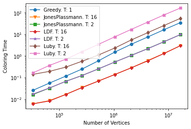

<h1 align="center">Parallel Graph Coloring</h1>

# Introduction

In mathematics, a graph is a structure composed by a set of objects called “Vertices” and a set of links which connect pairs of these vertices called "Edges" (or "Links") which describe a relationship between the objects.
These edges may be directed or undirected, to define a unidirectional or bidirectional relationship between the nodes associated with each link. In our study we will focus only on undirected graphs (a graph with undirected links).

Graph coloring is a well-known problem in the field of discrete mathematics:
Each vertex must be assigned a label (which in the context is defined as "color").
The coloring must respect some constraints:
1. Each vertex must have a different color than the neighboring vertices (vertices with which it has an edge in common)
2. The number of distinct colors in the entire graph must be as few as possible.
   
It has been proved that this is an NP-complete problem, for which an optimal resolution would require a non-polynomial time for a deterministic.

Although the optimal solution is impractical, several algorithms have been developed to be able to reach sub-optimal solutions in much faster times.

Therefore, the goal of this project is to implement and analyze the performance in terms of time and memory of different algorithms, proposed in distributed contexts, making use of techniques to parallelize the graph coloring process.

# Overview

The project is divided into the following categories:
1. `Utils/`: A set of libraries for parallelization and benchmarks
2. `Vertex/`: It contains the data structures for the management of the summit, with representation of the neighbors through adjacency list
3. `Graph/`: Data structures for managing the Graph, and loaders from `.gra` and `.graph` files
4. `Colors/`: Utilities for efficient management of vertex coloring (based on [Boost library](https://www.boost.org/))
5. `Solve/`: Algorithms used for the sequential and parallel solution of the problem

## Utils

### Benchmark

This file contains a series of functions for measuring the performance in terms of time and number of colors used, checking the correctness of the coloring and printing the results generated by the different algorithms on a `.csv` file.

### Duration Logger

The class is used for measuring the time taken by the algorithm to color the graph, through

```cpp
class DurationLogger {
private:
    std::chrono::steady_clock::time_point _start;
public:
    void start();
    double stop(); //return difference between start and now
};
```

### Range

Class for splitting a range [0-N) into approximately **equal** and **non-overlapping** M sub-ranges. This class is used in concurrent algorithms to assign an exclusive set of vertices to each thread (based on his thread ID) with minimal communication and computation cost.

### Parallel For Each

Template function that allows you to call a `F&& fn` function for each element of the vector `std::vector<V> &vector`.

The `fn` functions are executed **sequentially** (if the number of vector elements is extremely small) or in **parallel** by a number of threads defined by `numThreads`. Each thread acts on a sub-span of the vector thanks to the [Range](#range) class.

```cpp
void parallelForEach(size_t numThreads, std::vector<V> &vector, F&& fn);
```

## Vertex

The vertex class allows us to obtain information about a vertex in the context of graph theory.
As anticipated, the neighbors of the vertex are represented through an adjacency list.
We have decided to implement the adjacency list using a vector `std::vector<int> _adjV`, since in the algorithms implemented a sequential access is generally made to the neighbors of the vertex.
Using a vector rather than a list, we noticed that the time performance increased by 20% on average, probably because the adjacent nodes are allocated in contiguous chunks of memory, increasing the cache hit rate with respect to the list implementation. Moreover, in all the graph coloring algorithms no insertions or deletions are needed once the graph is loaded, therefore the advantages of lists are not relevant.

Some functions are exposed, including:
1. `int getColor() const`: return `UNCOLORED (-1)` if it has not yet been colored, otherwise the previously assigned color
2. `const std::vector<int> &getAdjV() const`: returns a const reference of the adjacency vector
3. `unsigned int getDegree() const`: returns the degree of the vertex, used in LDF and Luby. With function overloading we implement a variant used to calculate the degree of a vertex considering only a subset of the graph. This is achieved by passing to the function a `std::vector<char>` or a `boost::dynamic_bitset<>` representing a (bit)map of the active nodes in the sub-graph. This is used in Luby algorithm.

## Graph

### Graph

Class that allows the management of the graph. Among the most used functions:
1. `std::vector<Vertex> &getVertices()`: returns the vector of vertices related to the graph
2. `void addEdge(int v1, int v2)`: adds an edge between the vertices `v1` and `v2`
3. `bool isColored()`: returns `true` if the graph is completely colored and no node has a color equal to its neighbor
4. `void colorVertexMinimum(Vertex &v)`: colors a vertex with the **smallest available color**, considering all colored neighbors. Colors are represented as integers. To find the smallest available color we used `boost::dynamic_bitset<>` to represent a map of neighbors colors. This allows to find the first free slot (bit) very efficiently using `find_first()` library function while using less space possible. Note: *boost::dynamic_bitset* is not thread-safe, but does not represent a problem since all coloring algorithms use this function avoiding by design all potentially concurrent accesses.

### Loaders


Functions that allow you to generate an object of type `Graph` by reading a DIMACS (`.gra`) or DIMACS-10 (`.graph`) file.

- DIMACS-10: The DIMACS-10 format is essentially an adjacency list: the i-th row contains the list of neighbor IDs. Two loaders from this file type have been implemented:
  - Sequential: the main thread reads the line from file, generates a vertex and then assigns the list of its neighbors.
  - Parallel: The main thread reads each line of the file and places it in a thread-safe queue (Jobs class). N threads read from this queue and generate the graph vertex by vertex.
  
  
- DIMACS: The DIMACS format is an adjacency list like DIMACS-10, where only higher ID are represented (the lower ones being implicit). In this case we only implemented the sequential load.

## Solve
All the classes below extend the `Solver` class, which defines an abstract `void solve (Graph &)` method, which is then defined by the underlying solvers according to the algorithms that have been proposed.

### Greedy
`Greedy` implements the simple, well-known greedy strategy described in the specifications document, and mentioned in literature in [A Comparison of Parallel Graph Coloring Algorithms, J. R. Allwright, 1995](https://www.researchgate.net/publication/2296563_A_Comparison_of_Parallel_Graph_Coloring_Algorithms). It is a sequential solution to the problem. The main idea behind is to choose a random permutation of the vertices and in sequence, assign the smallest possible color.

### Luby
`Luby` implements the algorithm from [A simple parallel algorithm for the Maximal Independent Set problem, M. Luby, 1985](http://compalg.inf.elte.hu/~tony/Oktatas/Osztott-algoritmusok/mis_1986_luby.pdf).
Starting from a graph G, the algorithm is divided into two steps:
- The first one is the *Choice Step*: all the vertices with degree = 0 are added to a list of candidates. The remainder are added to the list of candidates with a probability inversely proportional to the degree.
- The second step is the *Remove edges*: if there are two vertices connected by an edge, the one with the lowest degree is discarded from the list of candidates. All candidates are removed from graph G.
The list of selected vertices is a MIS, which can be colored in parallel with a single color. At this point the algorithm restarts with the selection of a new MIS, until the complete coloring of the graph.

### Jones & Plassmann
`JonesPlassmann` implements the algorithm from [A parallel graph coloring heuristic, M. Jones and T. Plassmann, 1992](https://www.researchgate.net/publication/2768023_A_Parallel_Graph_Coloring_Heuristic). Jones' algorithm defines an ordering of the vertices based on randomly assigned `weights`, and then colors each node for which all uncolored neighbors have a lower weight (*local max*). 

The original Jones' paper describes the algorithm in terms of messages sent between different processors, containing the weights associated with each vertex that are calculated by the processor.
We generate the `weight` vector associated with the vertices sequentially and with random weights.
Vertices are split into approximately **equal** and **non-overlapping** sets and assigned to specific threads (thanks to [Range](#range) class). 

Each thread separates its vertices into border vertices (vertices that have at least one edge connected to a vertex of another processor) and local vertices (the remaining ones).

At each round, the frontier vertices that have the greatest weight (`weights[v]` where v represents the vertex) among the neighbors (belonging to the other processors and still not colored) are colored.
Comparison criterion:
```cpp
v can be colored
for (auto w: adjV) {    
    if (w is not local)
        if(w is UNCOLORED
            && weights[w] > weights[v])
            v cannot be colored
}

if (v can be colored)
    color(v)
```
At the end of each round, a synchronization mechanism is needed to assure that all threads finished the previous round before starting a new one. This is implemented using `std::condition_variable`, `std::unique_lock` and `std::mutex` from STL C++ library.

Once the border vertices are fully colored, each thread can independently proceed to color the local vertices. In this way the final phase of the algorithm is highly parallelized, since no synchronization between the threads is necessary.


### Largest Degree First
`LDF` implements the algorithm from [A Comparison of Parallel Graph Coloring Algorithms, J. R. Allwright, 1995](https://www.researchgate.net/publication/2296563_A_Comparison_of_Parallel_Graph_Coloring_Algorithms).
The algorithm is very similar to the previous Jones Plassmann, but the comparison criterion between the nodes varies: the nodes are colored based on the degree of the vertex. If two adjacent vertices have the same degree, Jones Plassmann's criterion is used.
Comparison criterion:
```cpp
v can be colored
for (auto w: adjV) {    
    if (w is not local)    
        if(w is UNCOLORED) &&
            ((w_degree > v_degree) ||
            (w_degree == v_degree && weights[w] > weights[v]))            
            v cannot be colored
}

if (v can be colored)
    color(v)
```
With this criterion, the algorithm performs the coloring using on average less colors with respect to the random one.

# Results

All tests were performed on Linux platform (Ubuntu 21.10 operating system). The processor used is an AMD Ryzen 7 3700X, 3.4 GHz (8 cores, 16 threads), with 16GB of RAM.

The tests were executed on datasets of various kinds, but we will show only the results referring to the rgg graphs, since they have a similar topology and so they allow a better comparison.

In `benchmark.csv` and` memory.csv` files, we reported the results for what concerns the total number of colors used, the total time in seconds used to color the graph, the overall time for loading the graph and the memory occupied by the program for the graph `rgg_n_2_22_s0.graph`

|    | Graph               |     V |      E |   MaxDegree | Algorithm      |   NumThreads |   LoadTime |   ColoringTime |   NumColorsUsed |
|---:|:--------------------|------:|-------:|------------:|:---------------|-------------:|-----------:|---------------:|----------------:|
|  0 | rgg_n_2_15_s0.graph | 32768 | 160240 |          24 | Greedy         |            1 |   0.055024 |       0.025687 |              15 |
|  1 | rgg_n_2_15_s0.graph | 32768 | 160240 |          24 | Luby           |            2 |   0.055024 |       0.163748 |              14 |
|  2 | rgg_n_2_15_s0.graph | 32768 | 160240 |          24 | JonesPlassmann |            2 |   0.055024 |       0.016391 |              13 |
|  3 | rgg_n_2_15_s0.graph | 32768 | 160240 |          24 | LDF            |            2 |   0.055024 |       0.017245 |              13 |

## Number of Colors per algorithm

We confirm empirically that LDF and Jones Plassmann are the best solvers in term of total number of color used. 
We noticed that the number of colors may change sligthly for the same algorithm when we use different number of threads.

The table below shows the number of average colors used for coloring the graph, depending on the number of threads (1, 2, 4, 8, 12 and 16)

| Graph               |   Greedy                      |  JonesPlassmann                       | LDF                        | Luby                        |
|:--------------------|------------------------------:|--------------------------------------:|---------------------------:|----------------------------:|
| rgg_n_2_15_s0.graph |                            15 |                                  13.6 |                       13.4 |                        14.8 |
| rgg_n_2_16_s0.graph |                            16 |                                  15   |                       15.2 |                        16.6 |
| rgg_n_2_17_s0.graph |                            17 |                                  16   |                       16   |                        16.4 |
| rgg_n_2_18_s0.graph |                            18 |                                  17   |                       17.2 |                        18.2 |
| rgg_n_2_19_s0.graph |                            18 |                                  18.8 |                       18.4 |                        19.6 |
| rgg_n_2_20_s0.graph |                            20 |                                  18.2 |                       18.2 |                        19.8 |
| rgg_n_2_21_s0.graph |                            20 |                                  20.6 |                       20.4 |                        20.8 |
| rgg_n_2_22_s0.graph |                            22 |                                  21   |                       21   |                        22.4 |
| rgg_n_2_23_s0.graph |                            23 |                                  23   |                       23   |                        23.2 |
| rgg_n_2_24_s0.graph |                            24 |                                  23   |                       23   |                        24.4 |

As we can see, the LDF and Jones Plassmann algorithms achieve very similar performances, which reflect and even improve the results obtained by the sequential algorithm. Luby in most cases achieves a higher number of colors than the other algorithms.


## Coloring Time 

Through these tests, we would like to verify which algorithms allow a faster coloring time with respect to the number of vertices and the number of nodes.

### Coloring Time with respect to number of threads (log plot)

This test was performed on the graph `rgg_n_2_24_s0.graph` (16.8 million vertices).
The results of tests with 2, 4, 8, 12 and 16 threads for different algorithms have been reported.
As we can see, the fastest (and better scaling than threads) algorithms are Jonh Plassmann and LDF:
in fact they manage to color 16.8 million vertices in about 3 seconds with 16 threads.


### Coloring Time depending on the number of nodes (log plot)

This test was performed on rgg graphs, from `rgg_n_2_15_s0.graph` to `rgg_n_2_24_s0.graph`. 
As can be seen from the graph, the parallel algorithms are extremely more efficient than the sequential algorithm considering a sufficiently high number of threads.
As previously demonstrated, Luby continues to be the worst performing algorithm.
Jones Plassmann and LDF outperform the sequential version.



### Vertex Colored in one second.

| Graph               |   Greedy. T: 1 | JonesPlassmann. T: 2 | JonesPlassmann. T: 4 | JonesPlassmann. T: 8 |   JonesPlassmann. T: 12 | JonesPlassmann. T: 16 | LDF. T: 2 | LDF. T: 4 | LDF. T: 8 | LDF. T: 12 | LDF. T: 16 | Luby. T: 2 | Luby. T: 4 |Luby. T: 8 |  Luby. T: 12 | Luby. T: 16 |
|:--------------------|----------------------:|-------------------------------:|-------------------------------:|------------------------------:|------------------------------:|------------------------------:|--------------------:|--------------------:|-------------------:|-------------------:|-------------------:|---------------------:|---------------------:|--------------------:|--------------------:|--------------------:|
| rgg_n_2_15_s0.graph |           1.27566e+06 |                    1.99914e+06 |                   3.86734e+06 |                   5.10405e+06 |                    6.78848e+06 |                    5.37886e+06 |         1.90014e+06 |        3.86324e+06 |        4.93717e+06 |         6.77305e+06 |         5.37356e+06 |               200112 |              320466 |              289130 |               273517 |               233245 |
| rgg_n_2_16_s0.graph |           1.18576e+06 |                    2.01811e+06 |                   3.45636e+06 |                   6.3424e+06  |                    6.70171e+06 |                    7.6409e+06  |         1.98762e+06 |        3.24854e+06 |        6.37882e+06 |         6.8224e+06  |         7.9505e+06  |               180929 |              260102 |              378919 |               383278 |               340377 |
| rgg_n_2_17_s0.graph |           1.13158e+06 |                    1.95356e+06 |                   3.52249e+06 |                   5.44771e+06 |                    6.83485e+06 |                    7.88782e+06 |         1.98741e+06 |        3.39829e+06 |        6.09978e+06 |         6.7699e+06  |         7.96742e+06 |               186368 |              266657 |              432753 |               432762 |               433135 |
| rgg_n_2_18_s0.graph |           1.0556e+06  |                    2.09729e+06 |                   3.80509e+06 |                   4.66914e+06 |                    6.5184e+06  |                    7.48149e+06 |         2.11371e+06 |        3.77724e+06 |        6.19565e+06 |         6.76064e+06 |         7.62202e+06 |               166935 |              256377 |              442613 |               469555 |               460769 |
| rgg_n_2_19_s0.graph |      878054           |                    2.08492e+06 |                   3.7026e+06  |                   6.12615e+06 |                    6.41873e+06 |                    7.57335e+06 |         2.06623e+06 |        3.71804e+06 |        6.13877e+06 |         6.35801e+06 |         7.58562e+06 |               153015 |              249055 |              426539 |               434920 |               475660 |
| rgg_n_2_20_s0.graph |      692761           |                    1.99704e+06 |                   3.69637e+06 |                   5.9258e+06  |                    6.41716e+06 |                    7.53883e+06 |         2.00295e+06 |        3.66613e+06 |        6.09301e+06 |         6.47761e+06 |         7.56909e+06 |               136758 |              217155 |              392277 |               401622 |               448959 |
| rgg_n_2_21_s0.graph |      606317           |                    1.9729e+06  |                   3.44652e+06 |                   5.99865e+06 |                    6.36117e+06 |                    7.46897e+06 |         1.9922e+06  |        3.59029e+06 |        6.00569e+06 |         6.37339e+06 |         7.41407e+06 |               124557 |              200646 |              352341 |               366350 |               382995 |
| rgg_n_2_22_s0.graph |      560418           |                    1.92708e+06 |                   3.38176e+06 |                   5.9074e+06  |                    6.24103e+06 |                    6.83621e+06 |         1.96147e+06 |        3.4876e+06  |        5.76334e+06 |         6.21844e+06 |         7.13552e+06 |               115009 |              184677 |              325677 |               332622 |               354624 |
| rgg_n_2_23_s0.graph |      513617           |                    1.84068e+06 |                   3.22572e+06 |                   5.29962e+06 |                    5.68878e+06 |                    6.41872e+06 |         1.85435e+06 |        3.27876e+06 |        5.31866e+06 |         5.66256e+06 |         6.45378e+06 |               106729 |              175130 |              302243 |               309123 |               328420 |
| rgg_n_2_24_s0.graph |      483782           |                    1.73041e+06 |                   3.00655e+06 |                   4.66911e+06 |                    5.10085e+06 |                    5.66887e+06 |         1.7251e+06  |        3.01335e+06 |        4.83011e+06 |         5.10546e+06 |         5.60032e+06 |               102055 |              169638 |              282176 |               287165 |               306461 |


## Memory Usage

This test was performed on the graph `rgg_n_2_22_s0.graph` (4 millions vertices). 
The results were collected with `runlim-1.10` and the memory is expressed in MB.

|    | Graph               | Algorithm      |   NumThreads |   Memory |
|---:|:--------------------|:---------------|-------------:|---------:|
|  0 | rgg_n_2_22_s0.graph | Greedy         |            1 |    534.7 |
|  1 | rgg_n_2_22_s0.graph | Luby           |            1 |    553.7 |
|  2 | rgg_n_2_22_s0.graph | Luby           |            4 |    554.3 |
|  3 | rgg_n_2_22_s0.graph | Luby           |            8 |    554.6 |
|  4 | rgg_n_2_22_s0.graph | Luby           |           16 |    554.2 |
|  5 | rgg_n_2_22_s0.graph | JonesPlassmann |            1 |    543   |
|  6 | rgg_n_2_22_s0.graph | JonesPlassmann |            4 |    566.7 |
|  7 | rgg_n_2_22_s0.graph | JonesPlassmann |            8 |    598.9 |
|  8 | rgg_n_2_22_s0.graph | JonesPlassmann |           16 |    662.8 |
|  9 | rgg_n_2_22_s0.graph | LDF            |            1 |    542.9 |
| 10 | rgg_n_2_22_s0.graph | LDF            |            4 |    566.8 |
| 11 | rgg_n_2_22_s0.graph | LDF            |            8 |    598.9 |

We can see that the memory tends to grow in LDF or Jones Plassmann algorithms, while Luby always occupies almost the same memory with different number of threads.
As expected, JonesPlassmann and LDF have very similar performances.


# Conclusions

The choice of algorithm results in vastly different performances. Early multithread algorithms found in literature may perform significantly worse than simpler single-thread ones, and thus be only of theoretical interest; more recent ones typically provide a measurable speedup. Simple heuristics like FVF and SDL can outperform such algorithms, as they rarely miscolor the graph and such errors can be corrected quickly.

